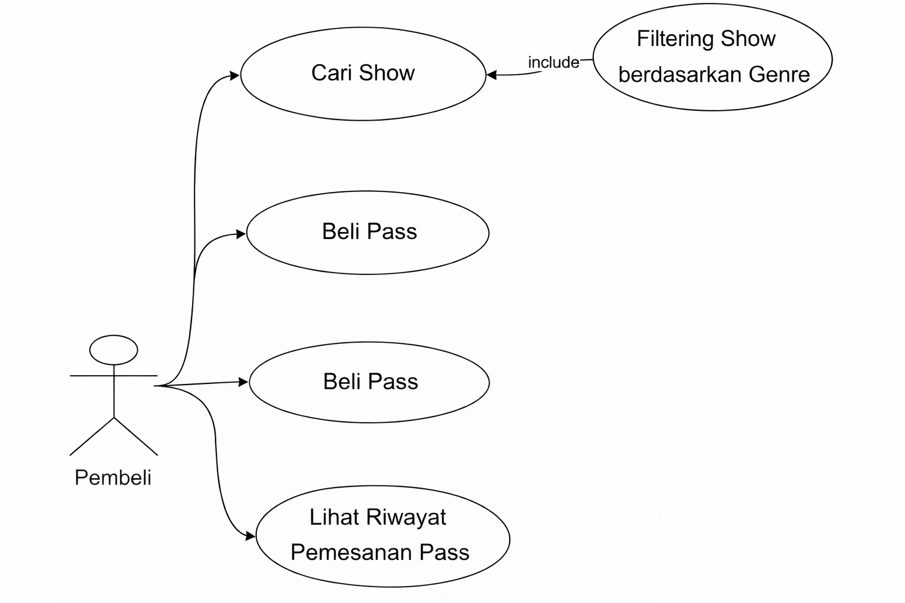
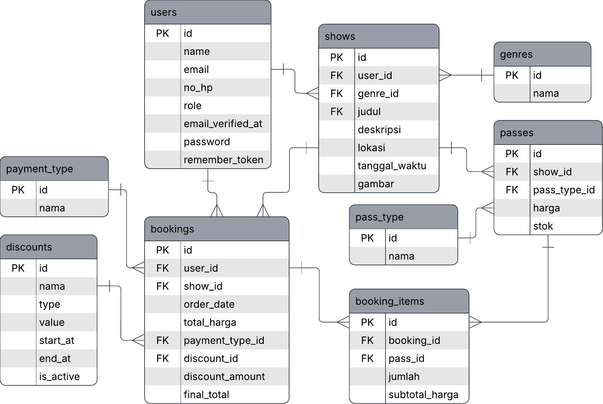

# KONSER-METAL - Aplikasi Ticketing Konser (Laravel)
## Gambaran Umum
##### Database: ticketing_system_new
##### Tema: Ticketing konser dengan genre musik metal atau rock
##### Deskripsi: Aplikasi ini digunakan untuk mengelola show konser (oleh admin) dan pemesanan tiket (oleh user). Data konser dikelompokkan berdasarkan genre, tiket memiliki tipe (mis. Regular/VIP/VVIP, dll) serta stok, dan transaksi booking tersimpan per item dengan jumlah dan subtotal. Sistem juga mendukung metode pembayaran dan diskon yang bersifat opsional.
##### Genre: 
Genre yang digunakan pada aplikasi:
1.	Heavy Metal
2.	Metalcore
3.	Nu Metal
4.	Hard Rock
5.	Post-Hardcore
6.	Alternative
##### Penyesuaian Nama untuk tema konser:
1. Kategori → Genre
2. Event → Show
3. Tiket → Pass / Passes
4. Order → Booking
5. DetailOrder → BookingItem
## Skema Aplikasi
1. Use case admin

2. Use case pembeli

3. Struktur database

## ERD dan relasi
### Entitas utama
- users: data akun dan role (admin / user)
- genres: master genre
- shows: data konser/show (judul, deskripsi, lokasi, waktu, gambar)
- pass_types: master tipe tiket (mis. VIP/Regular/VVIP/early bird)
- passes: tiket per show dan tipe (harga, stok)
- bookings: transaksi pemesanan (order_date, total, final_total, dll.)
- booking_items: detail item transaksi (pass, jumlah, subtotal)
- payment_types: master metode pembayaran (opsional di booking)
- discounts: master diskon (opsional di booking)
### Relasi
- users 1—* shows (shows.user_id)
- genres 1—* shows (shows.genre_id)
- shows 1—* passes (passes.show_id)
- pass_types 1—* passes (passes.pass_type_id)
- users 1—* bookings (bookings.user_id)
- shows 1—* bookings (bookings.show_id)
- payment_types 1—* bookings (bookings.payment_type_id, nullable)
- discounts 1—* bookings (bookings.discount_id, nullable)
- bookings 1—* booking_items (booking_items.booking_id)
- passes 1—* booking_items (booking_items.pass_id)
- M:N: bookings *—* passes via booking_items
- catatan: Secara konsep, Booking ↔ Pass adalah many-to-many karena:
  - satu booking dapat berisi banyak pass,
  - satu pass dapat muncul di banyak booking,
  - hubungan dihubungkan oleh tabel booking_items (booking_id, pass_id) yang juga menyimpan atribut transaksi (jumlah, subtotal_harga).
### Relasi Eloquent
1. Master & Konten
- User hasMany Shows ; Show belongsTo User
- Genre hasMany Shows ; Show belongsTo Genre
- Show hasMany Passes ; Pass belongsTo Show
- PassType hasMany Passes ; Pass belongsTo PassType
2. Transaksi
- User hasMany Bookings ; Booking belongsTo User
- Show hasMany Bookings ; Booking belongsTo Show
- Booking hasMany BookingItems ; BookingItem belongsTo Booking
- Pass hasMany BookingItems ; BookingItem belongsTo Pass
- Booking belongsToMany Passes (via booking_items) ; Pass belongsToMany Bookings (via booking_items)
3. Pembayaran & Diskon
- PaymentType hasMany Bookings ; Booking belongsTo PaymentType 
- Discount hasMany Bookings ; Booking belongsTo Discount 
